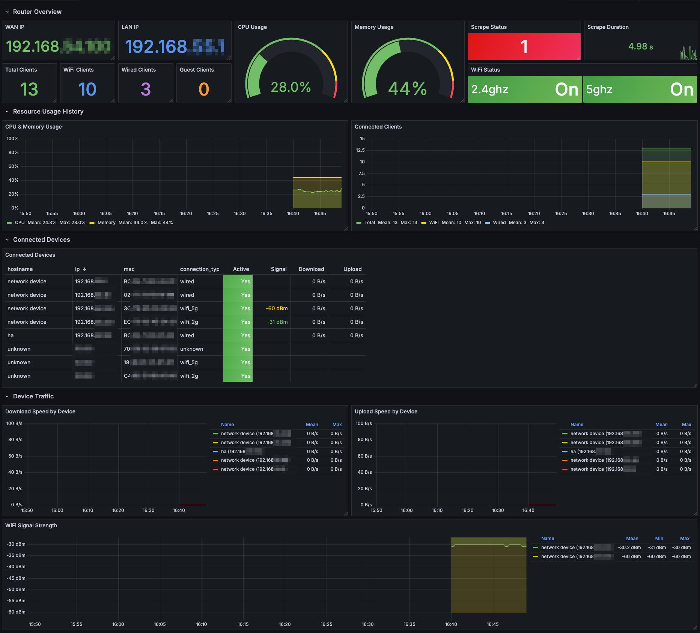

# TP-Link Router Exporter

Prometheus exporter for TP-Link routers using the [tplinkrouterc6u](https://github.com/AlexandrErohin/TP-Link-Archer-C6U) library.

Tested with TP-Link Archer AX55, but should work with other models supported by the library.

## Metrics

### Router Metrics

| Metric | Type | Description |
|--------|------|-------------|
| `tplink_router_info` | Gauge | Router information (WAN IP, LAN IP, connection type as labels) |
| `tplink_cpu_usage_ratio` | Gauge | CPU usage (0-1) |
| `tplink_memory_usage_ratio` | Gauge | Memory usage (0-1) |
| `tplink_clients_total` | Gauge | Total connected clients |
| `tplink_wifi_clients_total` | Gauge | WiFi clients count |
| `tplink_wired_clients_total` | Gauge | Wired clients count |
| `tplink_guest_clients_total` | Gauge | Guest network clients |
| `tplink_iot_clients_total` | Gauge | IoT network clients |
| `tplink_wifi_enabled` | Gauge | WiFi enabled state (labels: band, network_type) |

### Per-Device Metrics

All device metrics include labels: `mac`, `hostname`, `ip`, `connection_type`

| Metric | Type | Description |
|--------|------|-------------|
| `tplink_device_active` | Gauge | Device active state (1/0) |
| `tplink_device_signal_dbm` | Gauge | WiFi signal strength in dBm |
| `tplink_device_download_speed_bytes` | Gauge | Current download speed (bytes/s) |
| `tplink_device_upload_speed_bytes` | Gauge | Current upload speed (bytes/s) |
| `tplink_device_packets_sent_total` | Counter | Total packets sent |
| `tplink_device_packets_received_total` | Counter | Total packets received |

### Scrape Metrics

| Metric | Type | Description |
|--------|------|-------------|
| `tplink_scrape_success` | Gauge | Whether the last scrape succeeded (1/0) |
| `tplink_scrape_duration_seconds` | Gauge | Duration of the last scrape |

## Installation

### Docker

```bash
docker run -d \
  --name tplink-router-exporter \
  -p 9120:9120 \
  ghcr.io/ldziedziul/tplink-router-exporter \
  --host 192.168.0.1 \
  --password ${TPLINK_PASSWORD}
```

### Docker Compose

```yaml
services:
  tplink-router-exporter:
    image: ghcr.io/ldziedziul/tplink-router-exporter
    container_name: tplink-router-exporter
    restart: unless-stopped
    ports:
      - "9120:9120"
    command:
      - --host=192.168.0.1
      - --password=${TPLINK_PASSWORD}
```

### Python

```bash
pip install tplinkrouterc6u prometheus-client

python tplink_router_exporter.py --host 192.168.0.1 --password ${TPLINK_PASSWORD}
```

## Usage

```
usage: tplink_router_exporter.py [-h] [--host HOST] --password PASSWORD
                                 [--username USERNAME] [--https] [--verify-ssl]
                                 [--port PORT] [--listen LISTEN] [--debug]

options:
  -h, --help            show this help message and exit
  --host, -H HOST       Router IP address or hostname (default: 192.168.0.1)
  --password, -p PASSWORD
                        Router admin password (local password, not TP-Link ID)
  --username, -u USERNAME
                        Router admin username (default: admin)
  --https               Use HTTPS connection to router
  --verify-ssl          Verify SSL certificate (only with --https)
  --port PORT           Port to expose metrics on (default: 9120)
  --listen LISTEN       Address to listen on (default: 0.0.0.0)
  --debug               Enable debug logging
```

## Prometheus Configuration

### Single Router

```yaml
scrape_configs:
  - job_name: 'tplink'
    static_configs:
      - targets: ['localhost:9120']
    scrape_interval: 30s
```

### Multi-Target Mode (EasyMesh / Multiple Routers)

To monitor multiple routers (e.g., EasyMesh main router + satellites), use multi-target mode:

```yaml
scrape_configs:
  - job_name: 'tplink'
    metrics_path: /metrics
    static_configs:
      - targets:
          - 192.168.55.1    # Main router
          - 192.168.55.2    # Satellite
    relabel_configs:
      - source_labels: [__address__]
        target_label: __param_target
      - source_labels: [__param_target]
        target_label: instance
      - target_label: __address__
        replacement: localhost:9120
    scrape_interval: 30s
```

#### Per-Target Passwords

If routers have different passwords, set environment variables:

```bash
export TPLINK_PASSWORD_192_168_55_1="main_password"
export TPLINK_PASSWORD_192_168_55_2="satellite_password"
```

The exporter checks for `TPLINK_PASSWORD_<ip_with_underscores>` first, then falls back to `--password`.

#### Node Labels (Optional)

Add friendly names to metrics:

```bash
export TPLINK_NODE_192_168_55_1="main"
export TPLINK_NODE_192_168_55_2="satellite"
```

This adds a `node` label to the `tplink_router_info` metric.

## Grafana Dashboard

A pre-built Grafana dashboard is included in [`grafana/dashboard.json`](grafana/dashboard.json).

Import it via **Dashboards > Import > Upload JSON file**.



## Notes

- Use the **local router password**, not your TP-Link ID password
- The router only allows one admin session at a time - avoid opening the web UI while the exporter is running
- Recommended scrape interval: 30s or higher to avoid overwhelming the router

## License

MIT
